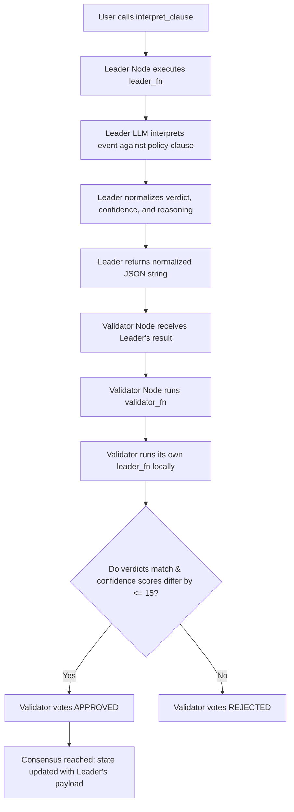

# Nuanced Clause Interpreter

A decentralized administrative and legal clause interpretation primitive built on GenLayer (v0.2.16).

In institutional management (such as school board policies, service level agreements, or employment contracts), rules and bylaws often contain ambiguous, subjective clauses like "reasonable effort", "appropriate educational use", "distracting commercial content", or "extreme weather conditions". Traditional smart contracts are deterministic and cannot evaluate real-world scenarios against these qualitative boundaries. This primitive solves that. It takes a subjective `policy_clause` and a `event_description` describing a real-world occurrence. It uses a decentralized LLM jury acting as fair administrative arbiters to determine how the event interacts with the clause, outputting a consensus-backed verdict: `APPLIES`, `DOES_NOT_APPLY`, or `AMBIGUOUS`.

---

## 🌟 Reusable Interpretation Primitive (Beyond a "One-Off Demo")

This contract serves as an automated administrative interpretation engine that can be integrated across multiple institutional flows:
1.  **Automated Policy Auditing:** School districts or university administrators can verify if student activities or event reports violate school handbook rules.
2.  **DAO Dispute Resolvers:** Automatically evaluate if a service provider's delayed delivery falls under a "force majeure" or "reasonable delay" exemption clause.
3.  **Freelance Escrow Release:** Release funds automatically when a project delivery document is verified to satisfy ambiguous contract constraints.

---

## 🏗️ Storage & State Design

The contract maintains state using GenLayer's persistent storage:
*   **`InterpretationRecord` (Struct):** An `@allow_storage @dataclass` holding the policy clause text, real-world event details, consensus interpretation verdict (`APPLIES`, `DOES_NOT_APPLY`, or `AMBIGUOUS`), validator confidence score (`bigint`), and qualitative reasoning.
*   **`records` (TreeMap):** A persistent lookup table mapped from `str(record_id)` to `InterpretationRecord`.
*   **`next_id` (bigint):** An auto-incrementing ID tracking the total number of interpretations recorded.

---

## 🤝 Custom Validator Consensus Logic

Interpreting qualitative legal clauses involves subjective semantic reasoning. To reach consensus stable against individual model biases, the contract uses a **Custom Validator** via `gl.vm.run_nondet_unsafe(leader_fn, validator_fn)`:



### Consensus Rules:
1.  **Normalization:** The LLM's interpretation verdict is normalized into either `"APPLIES"`, `"DOES_NOT_APPLY"`, or `"AMBIGUOUS"`. The confidence score is coerced to a `0..100` integer.
2.  **Verdict Category Equality:** The validator checks if its independent run yields the **exact same verdict** (e.g., both agree that the clause `APPLIES`).
3.  **Confidence Score Banding:** The validator checks if its confidence score is within an **absolute difference of 15 points** of the leader's score (`abs(leader_confidence - mine_confidence) <= 15`).
4.  **Reasoning Text Exemption:** The validator **ignores** differences in the qualitative `reasoning` string, preventing consensus failure due to harmless synonym variations in the generated explanation text.

---

## 🧪 Edge Case Testing Guidelines

You can test the contract using GenLayer Studio or CLI using the following scenarios:

### 1. Clause Triggers (APPLIES Path)
*   **Policy Clause:** "Employees are allowed to be absent in the event of extreme weather causing hazard to travel."
*   **Event Description:** "A level 12 typhoon warning issued for the city, and citizens are urged by the government to remain indoors."
*   **Expected Result:** Verdict: `APPLIES`, Confidence: `~90-100`, Reasoning confirming that a level 12 typhoon warning is indeed a hazardous extreme weather event.

### 2. Clause Not Triggered (DOES_NOT_APPLY Path)
*   **Policy Clause:** "Employees are allowed to be absent in the event of extreme weather causing hazard to travel."
*   **Event Description:** "A light morning drizzle with mild breeze."
*   **Expected Result:** Verdict: `DOES_NOT_APPLY`, Confidence: `~95-100`, Reasoning explaining that light drizzle does not constitute extreme weather or hazard.

### 3. Borderline Case (AMBIGUOUS Path)
*   **Policy Clause:** "Employees are allowed to be absent in the event of extreme weather causing hazard to travel."
*   **Event Description:** "A heavy thunderstorm warning is active, municipal buses are delayed by 40 minutes, but trains are running normally."
*   **Expected Result:** Verdict: `AMBIGUOUS`, Confidence: `~70-90`, Reasoning noting that while travel is difficult, public transportation is partially operational.

### 4. Edge Case: Empty Fields
*   **Inputs:** `policy_clause = ""` or `event_description = ""`
*   **Expected Result:** The contract throws a `UserError` immediately.

---

## 🌐 Deployment & Test Evidence

*   **Contract Address:** `[YOUR_DEPLOYED_CONTRACT_ADDRESS_HERE]`
*   **Network:** `studionet`

### Worked Example (Illustrative Example)

#### Example Call:
```python
contract.interpret_clause(
    policy_clause="Employees are allowed to be absent in the event of extreme weather causing hazard to travel.",
    event_description="A level 12 typhoon warning issued for the city, and citizens are urged by the government to remain indoors."
)
```

#### Expected Output (JSON from `get_record` view):
```json
{
  "id": "0",
  "policy_clause": "Employees are allowed to be absent in the event of extreme weather causing hazard to travel.",
  "event_description": "A level 12 typhoon warning issued for the city, and citizens are urged by the government to remain indoors.",
  "verdict": "APPLIES",
  "confidence": 98,
  "reasoning": "A class 12 typhoon warning meets the criteria for extreme weather conditions."
}
```
*Note: The reasoning field is illustrative of the natural language response, while the verdict and confidence band represent the verified consensus values.*
